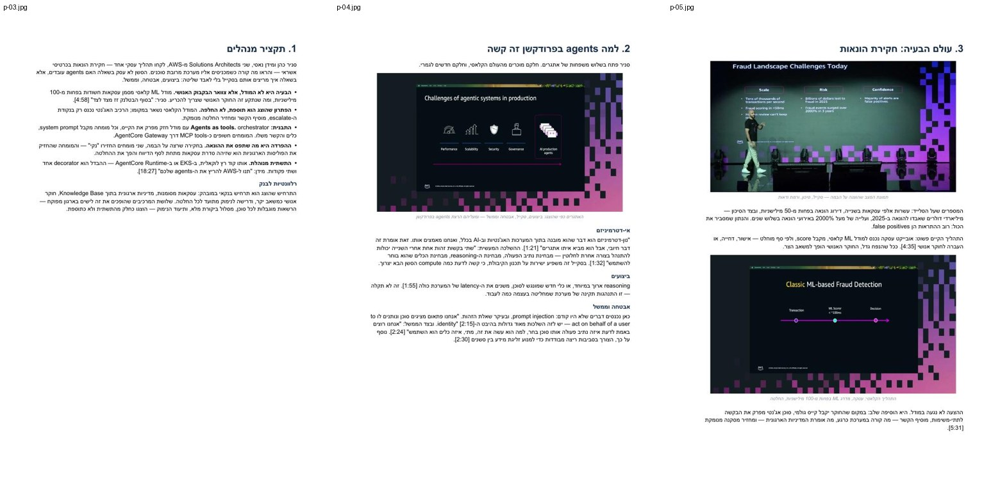
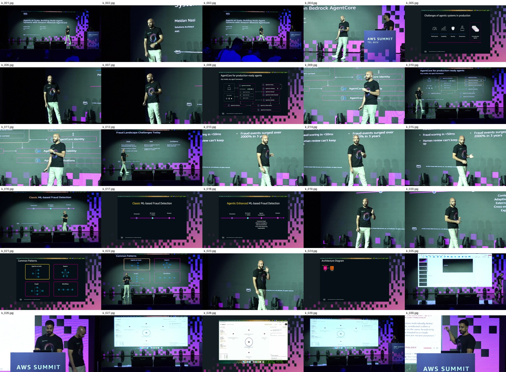
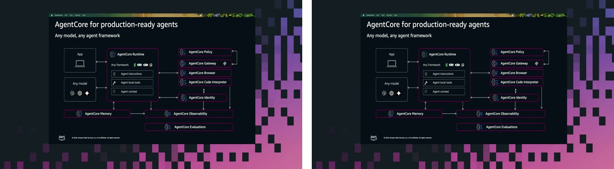

# recording-to-pdf

Turn a recorded talk into a document people actually read: a typeset PDF with
the speaker's own slides pulled out of the video, quotes that carry timestamps,
and correct right-to-left rendering for Hebrew.

Built for conference sessions and long workshops, where a 40-minute recording
is the only artefact and nobody is going to watch it twice.



*Three pages from the [example output](examples/dem304/DEM304_Agents_at_Scale_HE.pdf) — a 25-minute AWS Summit session rendered as a 14-page Hebrew review.*

## What it does

| Stage | What happens |
|---|---|
| **fetch** | Resolves the recording and downloads it. Handles YouTube, auth-gated Zoom, AWS Summit / Corrivium livestream sites, direct HLS, and local files |
| **asr** | Transcribes locally with Whisper on Apple Silicon, then collapses the output into 90-second timestamped blocks that are actually readable |
| **slides** | Scene-detects the deck out of the video, removes near-duplicates, and crops the slide rectangle out of the stage shot |
| **render** | Takes a `content.json` and produces DOCX + PDF, slides interleaved with the argument |

The writing between `slides` and `render` is yours — or your LLM's. That is
deliberate: this tool does the mechanical work and gets out of the way of the
judgement.

## Why it exists

Three things were harder than expected, and they are what this repo is really for.

**Hebrew in Word is not one problem, it is three.** Element order inside
`w:pPr`, complex-script properties (`w:szCs` / `w:bCs`, not `w:sz` / `w:b`), and
`w:jc` being *logical* inside a bidirectional paragraph, so explicitly
right-aligning Hebrew flushes it visually left. LibreOffice forgives all three
and renders your document fine. Word and Pages do not. `lib/builder.py` handles
them.

**The slides are in the video, at full resolution.** Scene detection gets one
frame per slide in a single decode pass. A 25-minute talk yields ~90 frames,
~55 unique, in about 40 seconds.



**Conference streams inset the deck into stage furniture.** The crop step finds
the screen rectangle and trims to it, so the document shows a deck rather than a
photograph of a stage. Frames where it finds nothing convincing pass through
untouched.



## Install

Requires `ffmpeg`, `yt-dlp`, LibreOffice (`soffice`), and Poppler (`pdftoppm`):

```bash
brew install ffmpeg yt-dlp libreoffice poppler
git clone https://github.com/kobyal/recording-to-pdf.git
cd recording-to-pdf
python3.12 -m venv .venv          # 3.12: mlx-whisper does not build on 3.14
.venv/bin/pip install -r requirements.txt
```

Transcription uses `mlx-whisper`, which is Apple Silicon only. On other
hardware, swap `lib/asr.py` for `faster-whisper` or `whisper.cpp`; nothing else
in the pipeline changes.

## Quickstart

```bash
bin/r2r fetch  "https://www.youtube.com/watch?v=..." work/
bin/r2r asr    work/ --lang he
bin/r2r slides work/
# look at work/frames/sheet_*.jpg, pick your slides, write content.json
bin/r2r render work/ --content content.json --name MyTalk_HE
```

`bin/r2r all <url> work/ --lang he` runs the first three and stops where
judgement starts.

## Sources

| Source | Notes |
|---|---|
| YouTube | Chapters become a free agenda. Check `yt-dlp --list-subs` first — real captions skip transcription entirely |
| Zoom | Needs `--cookies-from-browser chrome`. Without it `yt-dlp` reports "no video formats found", which looks like a format problem and is actually auth |
| AWS Summit / Corrivium | Resolves the event site to its CMS config and then to the MediaConvert HLS manifest. The video masters carry video-only renditions plus a separate audio group, so both are muxed explicitly |
| Direct HLS / local file | Passed straight through |

`bin/r2r list <event-url>` enumerates every session on a Corrivium event site,
and `lib/batch.py` runs the whole conference, deleting each video once the
frames are out so peak disk stays around a gigabyte.

## Writing content.json

The document is data. See [lib/schema.md](lib/schema.md) for the full schema and
[examples/dem304/content.json](examples/dem304/content.json) for a real one.

```jsonc
{
  "lang": "he", "rtl": true,
  "title": "...", "subtitle": "...", "meta": ["speaker · date"],
  "blocks": [
    {"kind": "h1",      "text": "1. Executive summary"},
    {"kind": "bullets", "items": [["The claim: ", "the evidence"]]},
    {"kind": "image",   "file": "k_012.jpg", "caption": "..."},
    {"kind": "table",   "headers": ["..."], "rows": [["..."]]},
    {"kind": "callout", "text": "...", "label": "Note"}
  ]
}
```

What makes the document good, learned the hard way:

- Interleave slides with the argument. An appendix of images gets skipped.
- Every quote verbatim, with its timestamp, checked against the recording.
- Bold lead on a bullet carries the claim; the rest carries the evidence.
- Reconcile transcript against deck. The slides hold facts the audio does not,
  and speech recognition garbles names and domain terms in every language.

## Using it with Claude Code

`SKILL.md` makes this a [Claude Code](https://claude.com/claude-code) skill —
copy the repo into `~/.claude/skills/recording-to-pdf/` and ask for a summary of
a recording. The model runs the stages, reads the contact sheets to choose
slides, writes `content.json`, and renders. That is how the example was made.

## Limitations

- Transcription is Apple Silicon only as shipped.
- A talking-head recording with no screen share yields no slides. Check a probe
  frame before running the whole video.
- The crop heuristic wants a roughly 16:9 screen with visible edges. Odd stage
  designs fall back to the uncropped frame.
- Long recordings are cheap to process and expensive to write. A six-hour
  workshop transcribes in about twenty minutes and still takes a day to write
  well.

## Credits

The pipeline and the right-to-left fixes came out of turning a 5h49m workshop
recording into a 42-page Hebrew review pack, then generalising it.

The example output summarises a public AWS Summit Tel Aviv 2026 session; the
slides in it remain the property of AWS and the speakers, reproduced here as
commentary on a public talk.

MIT licensed. Issues and pull requests welcome.
